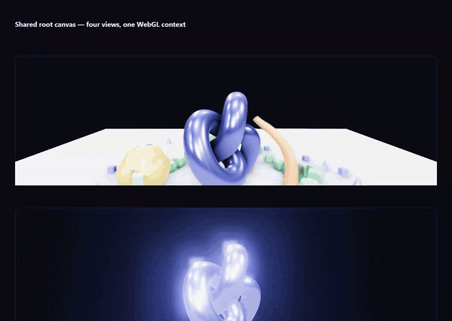

# Root Canvas

One `WebGLRenderer`, one full-page canvas, many independent 3D views anchored to DOM elements — each with its own scene, camera, post-processing chain, and lifecycle.

Adding 3D to a component does not allocate a WebGL context. Browsers cap contexts (typically 8–16) and silently drop the oldest when you exceed it; this architecture never gets near that limit no matter how many components render 3D.

**[Live demo →](https://sw7rvy.github.io/root-canvas/)**

```bash
npm install root-canvas three
```



Four views on one canvas, each with a different chain: SSAO + TAA over a scene exercising every motion-vector path; bloom with alpha preserved over the page; a full-view dot-screen; and a stencil-masked effect. Scroll — views render only while their anchor is on screen.

```bash
npm install
npm run dev      # http://localhost:5173
npm run build    # static bundle in dist/
npm test         # Playwright suite (see Tests)
npm run bench    # frame cost per configuration (see Performance)
```

## Quick start

```ts
import * as THREE from 'three';
import { createStage, StudioLighting } from 'root-canvas';

const stage = createStage({ maxPixelRatio: 2, exposure: 1.1 });
const envMap = stage.environment.room();

const view = stage.createView({
  element: document.querySelector('#hero')!,
  camera: new THREE.PerspectiveCamera(35, 1, 0.1, 100),
});

view.camera.position.set(0, 1.2, 4);
stage.environment.apply(view.scene, envMap, { intensity: 1.2 });
view.resources.track(new StudioLighting().attach(view.scene));

const mesh = view.add(
  new THREE.Mesh(new THREE.TorusKnotGeometry(0.6, 0.22), new THREE.MeshStandardMaterial()),
);

stage.onBeforeRender((delta) => {
  if (view.onScreen) mesh.rotation.y += delta * 0.6;
});
```

`view.add()` and `view.resources.track()` register objects for disposal. `stage.removeView(view)` or `destroyStage()` frees everything.

## How the shared canvas works

The canvas is `position: fixed; inset: 0; pointer-events: none`, sitting behind (or above) the page. Each `View` binds to a **DOM anchor element**. Every frame the registry measures the anchors, then renders each view with `setViewport`/`setScissor` mapped to its anchor's rect:

```
┌─ canvas (fixed, full viewport) ──────────────┐
│   ┌──────────┐                               │
│   │ #hero    │  ← view 1: scissor + viewport │
│   └──────────┘                               │
│              ┌──────────┐                    │
│              │ #product │  ← view 2          │
│              └──────────┘                    │
└──────────────────────────────────────────────┘
```

Scissor rects are clamped to the canvas; viewports are not, so projection stays correct when an anchor is partly off-screen. Views off-screen entirely are skipped (`renderOnlyWhenOnScreen`, default `true`).

Because the canvas ignores pointer events, input is captured once on `window` and hit-tested against anchor rects by descending `priority`, then converted to per-view NDC with a shared `Raycaster`.

## Packaging

`three` is a **peer dependency**, never bundled. Two copies of three break `instanceof` checks inside `EffectComposer`, and a library that ships its own copy guarantees exactly that — so the build externalises every `three` and `three/examples/jsm/*` import. Install it yourself alongside this package.

| | |
| --- | --- |
| bundle | 58 kB, 14.7 kB gzipped, ESM only |
| types | emitted from source, `moduleResolution: "bundler"` |
| side effects | none declared, so unused exports tree-shake |
| three | `>=0.170.0` as a peer |

```bash
npm run build:lib    # lib/root-canvas.js + lib/types/
npm pack             # runs build:lib first via prepack
```

### Releasing

`.github/workflows/release.yml` publishes on a `v*` tag. It typechecks, runs the full test suite, refuses to publish if the tag and `package.json` version disagree or if that version already exists on the registry, then publishes with [provenance](https://docs.npmjs.com/generating-provenance-statements) — a signed attestation tying the tarball to this repo, commit and workflow run.

One-time setup: create an npm **automation** token (or a granular token with *Bypass 2FA*), and add it as a repository secret named `NPM_TOKEN`.

```bash
gh secret set NPM_TOKEN        # prompts for the value; never commit it
```

Then each release is:

```bash
npm version patch              # or minor / major - commits and tags
git push --follow-tags
```

Publishing from CI is also why the token belongs here rather than on a workstation: it lives in one place, is scoped to this package, and every publish is traceable to a commit.

Verified by installing the packed tarball into a clean project: types resolve under `moduleResolution: "bundler"`, the full SSAO + TAA + velocity chain builds and runs, and the browser console stays clean.

## Files

| File | Responsibility |
| --- | --- |
| `RendererCore.ts` | Singleton `WebGLRenderer` + canvas, pixel ratio, resize, context-loss guards |
| `Stage.ts` | Single RAF loop, frame hooks, lifecycle, module-level singleton |
| `View.ts` | `View` + `ViewRegistry` — scissored multi-view rendering |
| `PointerPipeline.ts` | One set of window listeners → hit-tested, per-view raycast events |
| `LightingRig.ts` | Studio three-point rig with configured shadow frustum |
| `Environment.ts` | PMREM environment maps (RoomEnvironment / HDR), cached |
| `Effects.ts` | `ViewComposer` — per-view `EffectComposer` |
| `SSAOPass.ts` | Depth-driven screen-space ambient occlusion |
| `TAAPass.ts` | Temporal anti-aliasing (jitter + reprojection + neighbourhood clamp) |
| `VelocityBuffer.ts` | Motion vectors for every three.js mesh type |
| `Disposal.ts` | Recursive disposal of geometries, materials, textures, render targets |
| `ResourceTracker.ts` | Scoped registry → one `dispose()` per feature |
| `Emitter.ts` | Typed pub/sub with unsubscribe handles |

## Stage & renderer

```ts
createStage({
  maxPixelRatio: 2,      // capped DPR — the single biggest perf lever
  exposure: 1.1,
  toneMapping: THREE.ACESFilmicToneMapping,   // default
  shadows: true,
  stencil: true,         // default; needed for MaskPass
  alpha: true,
  antialias: true,
  autoStart: true,
  pauseWhenHidden: true, // stop the RAF loop on tab blur
  maxDelta: 1 / 20,      // clamp delta after a stall
});
```

Defaults worth knowing:

- `outputColorSpace = SRGBColorSpace`, `toneMapping = ACESFilmicToneMapping`
- `autoClear = false` — the frame clears once full-canvas, then each view clears depth (or colour, if it declares `clearColor`)
- Pixel ratio is `min(devicePixelRatio, maxPixelRatio)`, re-evaluated through a self-rearming `matchMedia("(resolution: Xdppx)")` watcher, so monitor changes and browser zoom are caught, not just window resizes

### Reduced motion

`Stage` reads `(prefers-reduced-motion: reduce)` and, by default, **freezes the clock rather than stopping the loop**: `delta` and `elapsed` stop advancing, so anything driven by them holds still, while rendering continues.

Continuing to render is the part that matters here. Views are scissored to DOM anchors, so a stage that stopped drawing would leave stale pixels behind the moment the page scrolled — the content would visibly detach from its box. Freezing time gives a still image that still tracks its anchor.

```ts
createStage({ reducedMotion: 'freeze' });   // default
createStage({ reducedMotion: 'ignore' });   // opt out entirely

stage.reducedMotion;              // live state
stage.elapsed;                    // animated seconds, frozen along with delta
stage.setReducedMotion(true);     // force it
stage.setReducedMotion(null);     // follow the viewer again
```

The media query is read live, so toggling the system setting takes effect without a reload. Because the clock is still sampled while frozen, resuming does not jump forward by the paused time.

Anything animating outside the stage's callbacks — a scroll library, CSS transitions — is yours to gate on `stage.reducedMotion`.

### Context loss

`webglcontextlost` is `preventDefault()`ed, the loop stops, and on restore the pixel ratio is reapplied, shadows are flagged for update, PMREM environments are regenerated (they do not survive), and TAA/velocity history is dropped. Subscribe via `stage.core.events.on('contextlost' | 'contextrestored', …)`.

## Views

```ts
stage.createView({
  element,                      // required DOM anchor
  scene, camera,                // optional; created if omitted
  priority: 1,                  // render + hit-test order
  interactive: true,
  clearColor: null,             // null = transparent, page shows through
  clearAlpha: 1,
  renderOnlyWhenOnScreen: true,
  disposeSceneOnDestroy: true,
  effects: { … },               // see below
  onUpdate: (delta, elapsed, view) => {},
  onRender: (renderer, view, delta) => {},  // full override
});
```

Per-view events: `pointermove`, `pointerdown`, `pointerup`, `pointerenter`, `pointerleave`, `click`, `wheel`, `resize`, `visibility`, `dispose`.

```ts
view.on('pointermove', ({ intersect, ndc, view }) => {
  view.element.style.cursor = intersect([mesh]).length ? 'grab' : '';
});
```

Cameras are kept in sync with the anchor's aspect automatically (perspective and orthographic).

## Post-processing

Per view, opt in with `effects`. The chain is assembled as:

```
RenderPass → [SavePass] → your passes → [AlphaRestore] → [TAAPass] → [OutputPass]
```

```ts
effects: {
  passes: ({ view, scene, camera, renderer, composer, renderPass, width, height, useSceneDepth }) =>
    new UnrealBloomPass(new THREE.Vector2(width, height), 0.55, 0.35, 0.85),
  samples: 4,            // MSAA on the composer target
  preserveAlpha: true,
  taa: true,
  depthTexture: true,
  resolutionScale: 1,    // render the chain below DPR
  type: THREE.HalfFloatType,
  output: true,          // append OutputPass
  blend: true,           // premultiplied composite onto the shared canvas
  stencil: true,         // inherits the context setting
}
```

The composer's final pass writes straight into the view's viewport/scissor on the shared canvas, blended with premultiplied alpha so a transparent view composites over the page instead of stamping an opaque rectangle.

**`preserveAlpha`** exists because some passes destroy alpha. `UnrealBloomPass` composites additively with alpha 1 across the whole quad, flattening a transparent view to opaque black. With it enabled, a `SavePass` captures the scene after `RenderPass` and a pass before `OutputPass` restores alpha in linear space:

```glsl
float added = max(0.0, dot(post.rgb - source.rgb, vec3(0.2126, 0.7152, 0.0722)));
gl_FragColor = vec4(post.rgb, clamp(source.a + added * spill, 0.0, 1.0));
```

`alphaSpill: 0` clips to the scene silhouette; `1` (default) lets glow carry alpha so bloom fades into the page. Skip it for views with an opaque `clearColor`.

### SSAO

```ts
effects: { depthTexture: true, passes: ssao({ radius: 0.6, power: 3 }) }
```

| Option | Default | Notes |
| --- | --- | --- |
| `kernelSize` | 32 | Hemisphere samples |
| `radius` | 0.25 | **World units** — scale to your scene |
| `bias` | 0.02 | Self-occlusion guard |
| `intensity` | 1 | Blend against unoccluded |
| `power` | 2.5 | Contrast exponent; without it AO on convex scenes reads as almost nothing |
| `blurDepthCutoff` | `radius` | Bilateral blur depth threshold |
| `output` | `'default'` | `'ao'` renders the raw AO buffer for tuning |

This is a custom pass rather than three's. `SSAOPass` hardcodes its own normal/depth G-buffer and re-renders the scene every frame with `MeshNormalMaterial` — an injected depth texture is impossible. `GTAOPass` accepts one, but that path throws in r180: `normalRenderTarget` is only assigned in `setGBuffer`'s internal branch, so the last line of that method dereferences `undefined`.

Normals are reconstructed from depth by a best-fit tap — sample left/right and down/up, take the tangent toward whichever neighbour's depth is closer to centre. Naive `dFdx`/`dFdy` reads across silhouettes and produces a dark rim tracing every outline. The blur is depth-weighted for the same reason.

### TAA

```ts
effects: { taa: true }                       // implies depthTexture
effects: { taa: { feedback: 0.9, velocity: true } }
```

| Option | Default | Notes |
| --- | --- | --- |
| `feedback` | 0.9 | History weight — stability vs responsiveness |
| `clampScale` | 1 | Neighbourhood rejection box size |
| `jitterScale` | 1 | Subpixel jitter amplitude |
| `sequenceLength` | 16 | Halton sequence length |
| `velocity` | `true` | Motion-vector buffer (second scene render) |

Each frame the projection matrix is offset by a Halton(2,3) subpixel jitter before the scene renders and restored after; `projectionMatrixInverse` is refreshed alongside so SSAO's reconstruction matches the jittered depth. Resolve reprojects, clamps history to the 3×3 colour box of the current frame, and blends with Karis luminance weighting so highlights don't flicker.

Jitter is applied through the generic `FrameHooks` interface — any pass may implement `onBeforeComposerRender` / `onAfterComposerRender` / `reset` and `ViewComposer` calls them around `composer.render()`.

### Velocity buffer

Without motion vectors, reprojection is camera-only: moving objects get their history rejected by the clamp and see no temporal benefit. The velocity pass renders the scene once more (unjittered) writing screen-space motion:

```glsl
gl_FragColor = vec4( currentUv - previousUv, 1.0, gl_FragCoord.z );
```

`.z` marks written pixels, `.w` carries depth for a 3×3 nearest-depth dilation that fixes edge ghosting. Pixels with no geometry fall back to depth reprojection, which covers camera motion over empty background.

Every three.js mesh type is handled. Three supplies the *current* transform for free — `USE_SKINNING`, `USE_INSTANCING`, `USE_MORPHTARGETS`, `USE_BATCHING` and their uniforms are set for any material — so the work is retaining the *previous* one:

| Source | Previous state |
| --- | --- |
| Object transform | `Matrix4` per mesh |
| `SkinnedMesh` | Mirror of `skeleton.boneMatrices` as a `DataTexture` |
| `InstancedMesh` | Mirror of `instanceMatrix`, fetched by `gl_InstanceID` |
| Morph targets | Previous influences (the morph texture itself is static) |
| Per-instance morphs | Mirror of `InstancedMesh.morphTexture` |
| `BatchedMesh` | Mirror of `_matricesTexture`, resolved through the **current** `getIndirectIndex(gl_DrawID)` |

Batched instances must be looked up by resolved id, not draw index — visibility and sort order change which instance a draw corresponds to, and using last frame's id texture would hand an instance its neighbour's history.

`Points`, `Line`, and `Sprite` are hidden during the pass. `BatchedMesh` support reads `_matricesTexture`, an internal three field with no public accessor; the mesh is skipped cleanly if it disappears.

## Memory

Three layers, all verified to return `renderer.info.memory` to zero:

```ts
view.add(mesh);                  // tracked, disposed with the view
view.resources.track(lighting);  // anything with dispose()
stage.removeView(view);          // disposes the view and its scene
destroyStage();                  // everything, including the canvas
```

`disposeObject` walks a subtree disposing geometries, materials, every texture referenced by material properties **and** shader uniforms, render targets, skeletons, and light shadow maps, guarding against double-disposal of shared resources. It also calls `dispose()` on `InstancedMesh` and `BatchedMesh` — those own textures (`morphTexture`, `_matricesTexture`) that nothing else frees.

## three.js notes

Things worth knowing before extending this, each of which cost real debugging time:

- **`EffectComposer.dispose()` does not dispose its passes.** `ViewComposer` tracks and disposes every pass it adds; passes pushed directly onto `composer.passes` are not tracked.
- **Read/write buffers never reset between frames.** With an odd number of swapping passes, the buffer `RenderPass` draws into alternates each frame — and so does its depth texture, since `RenderTarget.copy` *clones* rather than shares it. Anything sampling scene depth must re-bind per frame; use `useSceneDepth(consumer)` rather than caching the texture.
- **Three injects `<common>` into every `ShaderMaterial`,** which defines `luminance(const in vec3)`. An identically named helper fails to link and the pass renders black. Avoid three's chunk function names.
- **Every non-`RawShaderMaterial` compiles as `#version 300 es`** with ESSL1 compatibility defines, so `texelFetch`, `textureSize`, `gl_InstanceID`, and `gl_VertexID` are available in your own shaders.
- **`MaskPass` needs a stencil buffer** on the context *and* on the composer's render targets. Both are on by default here; `createStage({ stencil: false })` or `effects: { stencil: false }` opts out.
- **Multiple copies of three break `instanceof`** checks inside `EffectComposer.render`. `vite.config.js` sets `resolve.dedupe: ['three']`.

## Tests

`npm test` drives a real browser against `tests/harness.html`, a purpose-built page that exposes the stage so a test can build a scene, step frames one at a time, and read pixels back. Deterministic stepping is what makes the assertions numeric rather than timing-dependent.

| Spec | Asserts |
| --- | --- |
| `velocity.spec.ts` | Each of the six motion sources writes to the velocity buffer, a still scene writes nothing, and the mask channel stays off the background |
| `compositing.spec.ts` | Transparent views let the page through, `clearColor` views don't, `preserveAlpha` rescues a chain that flattens alpha, and views stay inside their anchors |
| `ssao.spec.ts` | Occlusion removes light, the contrast exponent is monotonic, and empty space stays unoccluded |
| `lifecycle.spec.ts` | One canvas across views, disposal returns memory to zero, context loss/restore discards stale history, targets track the anchor |
| `reduced-motion.spec.ts` | The preference freezes time but keeps rendering, `'ignore'` opts out, the state can be forced, and the query is read live |
| `combinations.spec.ts` | Every option combination renders without a shader or runtime error, plus orthographic cameras, `MaskPass` alongside TAA, `resolutionScale` sizing, and off-screen views allocating nothing |

`combinations.spec.ts` is a smoke tier, deliberately: it asserts each combination compiles, runs clean and draws something (measured as luminance variance, since a silently broken chain renders a flat rectangle). That covers the risk of a flag pairing nobody has ever run, not the correctness of what it drew — the other specs do that. Two of its checks go deeper: orthographic cameras must still produce motion vectors, and `resolutionScale` must shrink the composer *and* velocity targets.

The velocity tests work by rendering two frames, mutating exactly one motion source, rendering a third, then reading peak motion out of the buffer — so a failure points at one code path. Each was verified to fail when that path is deliberately broken; a test that cannot fail is not protecting anything.

Three notes if you extend them:

- `radius` is a bad axis to assert on. Past a certain size, samples land on the background and occlusion *drops*, so the suite tests `power`, which is monotonic by construction.
- The `output: 'ao'` buffer passes through tone mapping before a screenshot sees it, so an unoccluded 1.0 arrives near 226, not 255. That number is fixed maths and stable across GPUs; scene-dependent averages are not.
- The test server runs with HMR disabled. A hot reload mid-test destroys the execution context `page.evaluate` is running in, which shows up as a failure in whichever test happens to run first after an edit.
- Never assert on a wall-clock frame count. CI runs a software renderer that manages a couple of frames where a GPU manages sixty. Step frames explicitly and observe state changes through events instead — the context-restore test samples the TAA counter inside the `contextrestored` handler rather than racing the render loop for it.

## Performance

`npm run bench` measures each configuration against a running dev server. Numbers below: RTX 5080 through ANGLE/D3D11, headless Chromium, one 400×300 view at DPR 1, 563k triangles across 40 draws, median of 120 frames.

| configuration | frame ms | vs baseline | draws | target MB |
| --- | ---: | ---: | ---: | ---: |
| no effects | 0.05 | 1.00x | 40 | 0.0 |
| composer only | 0.08 | 1.78x | 41 | 1.8 |
| SSAO | 0.10 | 2.22x | 44 | 1.8 |
| TAA, no velocity | 0.07 | 1.67x | 43 | 3.7 |
| TAA + velocity | 0.14 | 3.11x | 83 | 4.6 |
| SSAO + TAA + velocity | 0.14 | 3.00x | 86 | 4.6 |
| everything at 0.5 scale | 0.13 | 2.89x | 86 | 1.1 |
| **everything + MSAA 4x** | **3.77** | **83.67x** | 86 | 4.6 |

Read the draw counts before the milliseconds — they are exact, while sub-millisecond timings on a fast GPU sit close to the noise floor.

- **Velocity costs one draw per mesh.** 43 → 83 draws on a 40-mesh scene is the second scene render, made visible. It is the single largest structural cost in the chain, and `taa: { velocity: false }` removes it.
- **SSAO is three draws**, TAA two, the composer blit one — all independent of scene complexity, so they scale with view resolution rather than geometry.
- **Views add up linearly**: two views on the full chain measured 172 draws against 86, and roughly double the frame cost.
- The full chain holds **60fps** under the real loop on this scene and GPU.

### Don't combine MSAA with passes that read depth

That 83x row is not a typo, and isolating it shows the cliff is specific:

| | frame ms |
| --- | ---: |
| MSAA 4x alone | 0.05 |
| MSAA 4x + depth texture, nothing reading it | 0.08 |
| MSAA 4x + a chain that samples depth | 3.77 |

MSAA is cheap until something reads the depth texture. The most likely explanation is that the multisampled depth must be resolved on every read, and SSAO plus TAA read it several times per frame — a resolve per read rather than per frame. I have not confirmed that in a driver trace, so treat the mechanism as a hypothesis and the measurement as fact.

TAA already anti-aliases, so the two are largely redundant. `ViewComposer` now warns when `samples` is combined with a depth-reading pass.

### What is not measured

WebGL exposes no usable GPU timer — Chrome disables `EXT_disjoint_timer_query_webgl2`, `gl.finish()` does not reliably drain the pipeline through ANGLE, and `clientWaitSync` cannot be busy-waited because command submission needs the event loop. These figures are therefore main-thread cost plus whatever the driver blocks on, which is the number that decides whether your page janks, not total GPU occupancy. Nothing here has been measured on mobile or integrated graphics, where the fill-rate costs will dominate differently.

## Deploying the demo

`.github/workflows/deploy.yml` typechecks, runs the test suite, then builds and publishes to GitHub Pages on every push to `master`. A failing test blocks the deploy and uploads the Playwright report as an artifact, and can be run by hand from the Actions tab. `vite.config.js` sets `base` to `/root-canvas/` for builds only, so local dev still serves from `/`.

The `gh-pages` branch it replaced has been deleted; Pages now builds from the workflow artifact.

## Limitations

- Velocity for `Points` / `Line` / `Sprite` falls back to depth reprojection.
- SSAO reconstructs normals from depth, so silhouette edges are approximate. A real normal buffer would fix it at the cost of the extra G-buffer render this design avoids.
- TAA's velocity pass is a second full scene render. Set `taa: { velocity: false }` on heavy scenes to trade moving-object quality for the draw calls.
- No WebGPU path. `WebGLRenderer` only.

## License

MIT — see [LICENSE](LICENSE).
